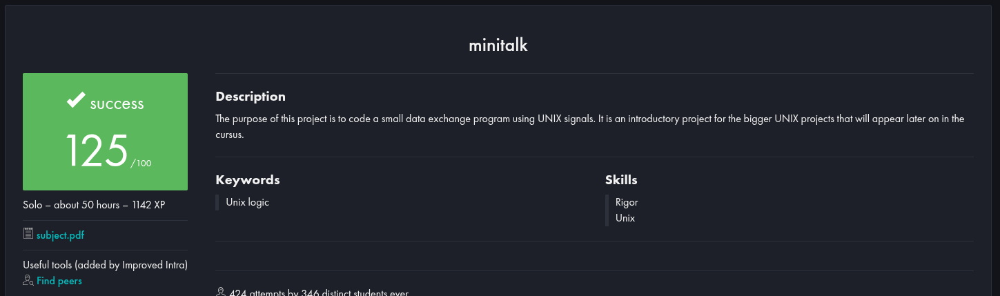

# 42 - Minitalk

)

Small data exchange program using UNIX signals

## Evaluation

## Testing

- [ThibaudM13/minitalk-Tester](https://github.com/ThibaudM13/minitalk-Tester)
- [sailingteam4/Minitalk-Tester](https://github.com/sailingteam4/Minitalk-Tester) - *The tester checks don't always work. They are the parsing error check and the norminette check. It is acceptable to use a global variable with norminette in this project, but the tester does not consider this to be an option. The code anticipates a different parsed message from the one I wrote. My error messages are more detailed.*
- [PepeSegura/minitalk](https://github.com/PepeSegura/minitalk)

